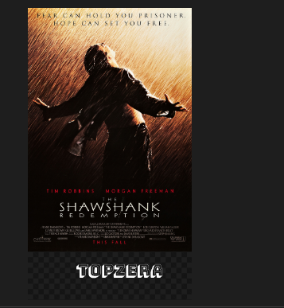
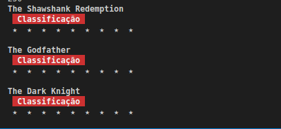
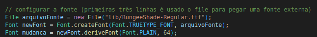

# Imersão Java

Imersão Java realizada pela Alura, trabalha com listas de filmes baseadas no IMDB, e stickers para WhatsApp (aulas em andamento)

<h1>Aulas</h1>

<h2>📚 Aula 1  e 2</h2>
<ul>
<li>

Realizado as classes App, JsonParser e Gerador de Figurinhas.

</li>
<li>

Utilizando uma api para puxar imagens, titulo e classificação de 250 top filmes do IMDB.

</li>
<li>

Com o gerador de figurinhas sendo chamado, e colocado os parâmetros de InputStream e o nome do arquivo, é gerado uma figurinha com a capa do filme, e uma descrição em baixo. 

</li>

<li>

Realizado exercícios para colorir o terminal e adicionar estrelas conforme a classificação do filme.

</li>

<li>

Como exercícios também foi colocado uma fonte externa no projeto.

</li>
</ul>

<h2>📚 Aula 3</h2>

<ul>
<li>Criado novas classes para melhor organização do código:
    <ol>
    <li>ClienteHttp</li>
    <li>Conteudo</li>
    <li>ExtratorDeConteudoDaNasa</li>
    <li>ExtratorDeConteudoDoImdb</li>
    </ol>
</li>
<li>Criado interface ExtratorDeConteudo</li>
</ul>

<h2>API utilizadas até o momento</h2>
<ol>
<li>

    <a href="https://mocki.io/v1/9a7c1ca9-29b4-4eb3-8306-1adb9d159060">API baseada na classificação do Imdb</a> criada pelo @rezendecas da comunidade da Alura

</li>
<li>

<a href="https://api.nasa.gov/">API da Nasa</a>, que você precisa criar sua própria chave para ter acesso ou usar uma chave de demonstração

</li>
</ol>